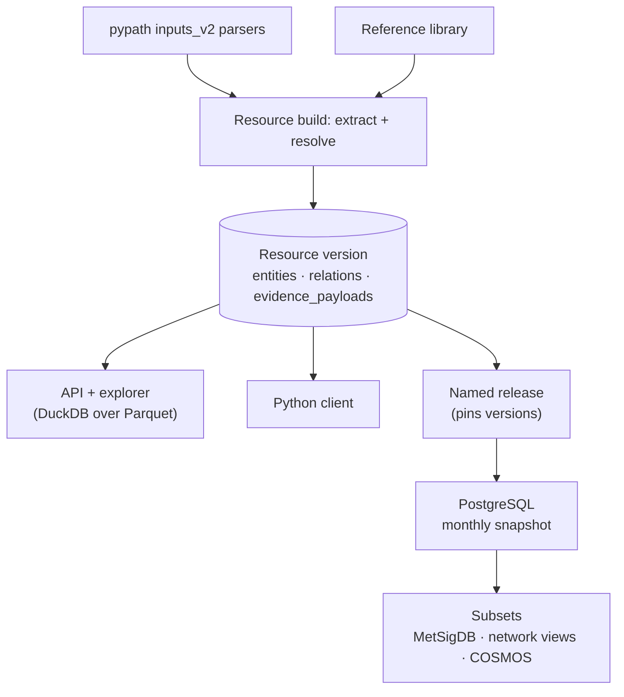

# System overview

OmniPath build turns many biological resources into one consistent knowledge
graph. Each resource is parsed, its entities are resolved against a shared
reference, and the result is published as immutable Parquet files. Everything
downstream (the API, the explorer, the Python client, PostgreSQL and the subset
products) reads those files and never repeats entity resolution.



## The four stages

| Stage | What happens | Owner package | Details |
| --- | --- | --- | --- |
| Parse | `pypath.inputs_v2` maps source rows to typed entities and relations | `pypath` (submodule) | — |
| Build | Extract, [resolve](resolution.md), aggregate, write three Parquets, publish atomically | `build`, `resolver`, `core` | [Entities](entities.md), [Resolution](resolution.md) |
| Serve | API and explorer query Parquet through DuckDB; the client reads the same files | `api`, `web`, `client` | — |
| Load | Pinned release → PostgreSQL relational schema → derived products | `postgres`, `subsets` | [PostgreSQL](postgres.md), [Subsets](subsets.md) |

> **Decision: the Parquet files are the contract between systems.** The three
> Parquets per resource version are the only interface between builder, serving
> and PostgreSQL. There is no shared database or cache.
> *Why:* the systems can run on different servers and update on their own
> schedules. See the [Parquet contract](glossary.md#parquet-contract).

> **Decision: resolve once, at build time.** Entity resolution happens before
> publication; nothing downstream resolves again. See [Entity resolution](resolution.md).

## Versions and schedules

Three version concepts keep the stages independent:

- A **[resource version](glossary.md#resource-version)** (for example SIGNOR
  `1.0.0`) is one immutable directory of Parquets. Versions are explicit
  numbers; reusing a version fails. Bump it when data, parser behaviour,
  resolution rules or the output schema change.
- A **[release](glossary.md#release)** (for example `2026.09`) is a small JSON
  manifest that pins one version per resource, plus the SHA-256 of each pinned
  build manifest.
- **[Latest](glossary.md#latest)** is the API default: the highest numeric
  version of every resource, updated as builds arrive.

The API follows Latest, or a release selected with `?release=2026.09`.
PostgreSQL loads one explicit release on its own monthly schedule. Publishing a
resource does not change PostgreSQL, and loading PostgreSQL does not change any
Parquet.

> **Decision: versions are immutable; releases pin them by content.** A resource
> version is never overwritten. A release records the SHA-256 of each pinned
> build manifest, and the PostgreSQL loader refuses a resource whose manifest no
> longer matches. *Why:* resources can update at any time while analyses stay
> reproducible, and a release name always means exact content.

> **Decision: sample builds stay out of releases.** Builds with a record cap or a
> dataset subset are refused by the publisher and the PostgreSQL loader unless
> the release sets `"partial_resources": true`. *Why:* a capped test build must
> never end up in a monthly snapshot by accident. (5 October 2026)

```text
data/
├── resources/<source>/<version>/
│   ├── entity.parquet, entity_identifier.parquet, entity_annotation.parquet,
│   │   entity_evidence.parquet                 # published tables
│   ├── relation.parquet, relation_annotation.parquet, relation_evidence.parquet
│   ├── evidence_payloads.parquet
│   ├── relation_endpoint.parquet, entity_group.parquet, entity_term.parquet
│   │                                           # serving tables (not downloaded)
│   ├── resolution_stats.json
│   └── build_manifest.json      # versions, row counts, sizes, checksums
└── releases/<release>.json      # pins resource versions + manifest digests
```

## Package ownership

| Package | Owns |
| --- | --- |
| `core` | Parquet schemas, vocabulary, keys, manifest contracts, version validation |
| `resolver` | Runtime matching, identifier normalization, index reads, the Rust decision kernel |
| `build` | Source ingestion, reference construction, resource assembly and publication |
| `postgres` | Pinned input, DuckDB projection, COPY, relational schema and shared derivations |
| `subsets` | MetSigDB, network views, COSMOS and the shared product runner |
| `api` / `web` / `client` | Serving, exploring and querying published Parquets |

Dependencies point one way: `build → resolver → core` and
`postgres → subsets → core`. Serving needs only `core` and `api`.

## Where to go next

- [Glossary](glossary.md): the vocabulary used throughout. Start with its key terms.
- [Entities and relations](entities.md): what a row means.
- [Entity resolution](resolution.md): how identifiers become entities.
- [PostgreSQL](postgres.md) and [Subsets](subsets.md): the downstream path.

Decisions are marked as **Decision** blocks on the page they belong to.
