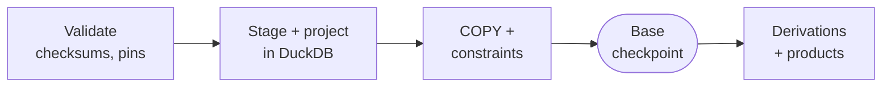

# PostgreSQL

PostgreSQL holds a fixed monthly snapshot of one explicit
[release](glossary.md#release). The loader projects already resolved Parquets
into main's existing relational layout so that main's queries, indexes and
products keep working. It performs no parsing and no entity resolution.

```sh
make load-postgres RELEASE_MANIFEST=release.json DATA_ROOT=/path/or/https \
  POSTGRES_SCHEMA=release_2026_09
make finish-postgres POSTGRES_SCHEMA=release_2026_09   # resume after an interruption
```

Every load goes into a **new schema**. The input can be a local directory or an
HTTPS endpoint with byte-range support.

## Load phases



1. **Validate.** SHA-256 checksums, Parquet schemas, sizes and row counts are
   checked against the build manifests, and each build manifest against the
   digest pinned in the release. Sample builds are refused unless the release
   sets `"partial_resources": true`.
2. **Stage and project.** DuckDB reads entity and relation Parquets once into a
   local working database and computes every relational table there.
3. **COPY.** CSV bytes stream straight into PostgreSQL. Python never turns
   biological rows into objects.
4. **Constraints and indexes** are restored and validated, then the base
   commits. This is the **base checkpoint**.
5. **Derivations and products** each commit with a phase record. A failure
   rolls back only the unfinished step; `finish` skips completed ones.

A schema advisory lock prevents overlapping builds on the same schema. A
failure before the base checkpoint drops the schema the loader created.

> **Decision: durable checkpoints, no mandatory verification run.** The base and
> each later step commit on their own and are skipped on retry. Fixture and
> parity tests are developer checks; production loads have no
> rebuild-and-compare phase. *Why:* full loads are long, and resuming must not
> redo finished work.

## How published data maps to tables

| Published | PostgreSQL | Notes |
| --- | --- | --- |
| entity key | `entity.entity_id` | Deterministic UUID of the full published key |
| entity type, namespace | `vocab_entity_type`, `vocab_identifier_type` | Published values; namespace spellings adapted to main's labels |
| identifiers | `identifier_evidence`, `entity_identifier` | Deduplicated dictionary plus links; safe bare aliases added for lookup (`CHEBI:15377` → `15377`) |
| annotations | `annotation`, `annotation_quantity`, `*_annotation` links | Units, prefixes and comparators kept in `annotation_quantity` |
| statement | `relation` + `relation_evidence_relation` | `relation` is main's graph triple (subject, predicate, object). Several qualified statements can share one triple; their qualifiers stay distinct on evidence |
| evidence occurrence | `relation_evidence`, `entity_evidence` | One row per occurrence; duplicates keep separate UUIDs |
| ontology statements | `entity_ontology_relation` | Not part of the `relation` graph |
| reference keys | `entity_reference_context`, `statement_reference_context` | Exact `reference_entity_key` and `gene_reference_keys` |
| molecular forms | `molecular_evidence_context` | One row per occurrence, with the nested form as JSON |
| raw payloads | — | Stay in Parquet only |

Resolution status in PostgreSQL is always `published` (status 5,
mechanism `published_parquet`). The loader does not pretend to know the old
`matched` / `ambiguous` resolver diagnostics, because the Parquets do not carry
them.

> **Decision: reproduce main's layout without re-resolving.** The loader fills
> main's existing tables and indexes and adds context tables for references and
> molecular forms. *Why:* main's queries and products keep working, and nothing
> in the database claims more than the Parquets contain.

> **Decision: raw payloads stay in Parquet.** Source payload JSON and nested
> record JSON are not loaded. The optional `parquet_*` inspection tables have no
> scientific reader. *Why:* the database stays the size of its scientific
> content; the pinned Parquets remain the provenance record.

Release bookkeeping lives in `parquet_release`, `parquet_phase` and
`subset_build_metadata`.

## Table groups

| Group | Tables |
| --- | --- |
| Dictionaries | `vocab_*`, `data_source`, `dataset` |
| Core graph | `entity`, `relation`, `identifier_evidence`, `entity_identifier`, `annotation` |
| Evidence | `entity_evidence*`, `relation_evidence*` (partitioned by source) |
| Molecular context | `entity_reference_context`, `statement_reference_context`, `molecular_evidence_context`, `annotation_quantity` |
| Shared derivations | ontology terms and closure, search and names, chemical classes, interactions, bitmaps, source counts and overlap |
| Optional inspection | `parquet_entity`, `parquet_statement`, `parquet_evidence`, `parquet_*_occurrence` (only with `--retain-published-provenance`) |

## Known adaptations

- An entity with conflicting known taxa across resources gets a NULL canonical
  taxon; each occurrence keeps its own.
- Colliding source-scoped name identities use main's
  `omnipath:unresolved_entity_key` namespace instead of being merged.
- `ontology_terms` stays empty, as in main; `entity_ontology_term` is derived.

The column-by-column rules are in
[`docs/postgres-parquet-column-map.md`](../docs/postgres-parquet-column-map.md).
