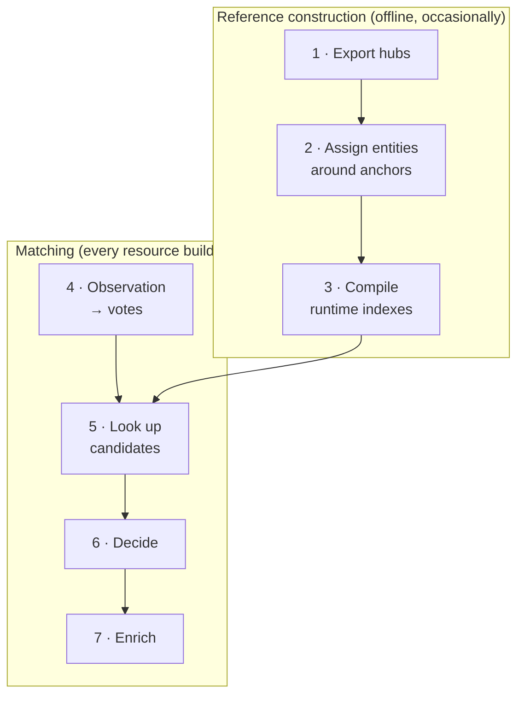

# Entity resolution

Resolution decides which entity a source observation refers to. It has two
parts. First, **reference construction** builds the reference library offline
from identifier hubs. Then, during every resource build, **matching** looks up
each observation's identifiers in that library and decides whether one entity
is supported.

> **Decision: resolve once, at build time.** Resolution runs inside the
> resource build, before Parquet publication. The API, PostgreSQL and the
> subsets use the published identities and never resolve again.
> *Why:* one place owns identity, so every consumer sees the same entities.
> A change to resolution rules therefore needs a new resource version.

> **Decision: abstain rather than guess.** When evidence is missing,
> conflicting or ambiguous, the observation keeps its own identifier.
> *Why:* a false merge silently corrupts every downstream result, while an
> unresolved entity is visible and fixable. Judge resolution by correctness
> first and coverage second. A high unresolved rate can be correct.



## 1. Hubs

A **[hub](glossary.md#hub)** is a normalized export of one reference database.
Every row says *this record of the hub carries this identifier*:

| Field | Meaning | Example |
| --- | --- | --- |
| `hub_id` | The hub's own record | `15377` in the ChEBI hub |
| `source_type`, `source_id` | An identifier attached to that record | `inchikey`, `XLYOFNOQVPJJNP-UHFFFAOYSA-N` |
| `taxonomy_id` | Organism of the record; `0` for chemicals | `9606` |
| `backend` | Where the mapping came from | the providing download |

| Domain | Hubs |
| --- | --- |
| Chemical | ChEBI, PubChem, ChEMBL, HMDB, LIPID MAPS, SwissLipids, BiGG, MetaNetX, RefMet, RaMP |
| Gene and protein | UniProt, NCBI Gene, RaMP genes, plus Ensembl gene mappings and UniProt's RefSeq and EMBL-CDS sequence mappings |

```bash
omnipath-build export-hubs --output-dir data/reference/hubs --max-records 0 --no-library
```

## 2. Assigning reference entities

`build-library` turns the hubs into reference entities
([`build_reference.py`](../packages/build/omnipath_build/reference/build_reference.py)).
It runs once per domain in checkpointed DuckDB stages. A missing hub stops the
build rather than producing a partial reference.

Entities are built around **[anchors](glossary.md#anchor)**: identifiers that
define identity on their own.

| Domain | Anchor | Entity ID |
| --- | --- | --- |
| Chemical | A valid full InChIKey (the empty-structure InChIKeys are ignored) | `inchikey:XLYOFNOQVPJJNP-UHFFFAOYSA-N` |
| Protein | The UniProt record's own primary accession | `uniprot:P04637` |
| Gene | NCBI Gene records are gene identities directly | `entrez:7157` |

The assignment then works record by record:

1. **Records and their anchors.** Each hub record (for example `chebi:15377`)
   collects the anchors it claims. A record with exactly one anchor belongs to
   that anchor's entity. A record that claims **more than one** anchor is
   *quarantined*: it stays its own entity and is never used to join others.
2. **Cross-references become edges.** Every cross-reference between two records
   of the same domain is an edge. UniProt ↔ NCBI Gene references are the
   exception: they become *gene–product links*, not identity edges.
3. **Anchorless records form components.** Records without an anchor are
   connected through their cross-references. The Rust `anchor-components`
   binary computes connected components over **anchorless records only**.
   Anchors never enter this graph, so two anchors can never be merged through
   a chain of cross-references.
4. **Each component is decided as a whole** by looking at the anchored records
   it touches:

   | The component touches | Decision | Result |
   | --- | --- | --- |
   | exactly one anchor | `attached` | Every record joins that anchor's entity |
   | no anchor | `anchorless_component` | The records form one entity of their own |
   | two or more anchors, or a quarantined record | `ambiguous_native` | Every record stays a separate native entity |

5. **Lipid names.** Lipid shorthand names are normalized with Goslin and
   connected through a virtual node. Every record with the same normalized name
   sees every anchor claimed for it, so conflicting structures behind one name
   become visible instead of hidden.
6. **Gene–product links.** A UniProt protein is linked to an NCBI Gene when
   either hub states the link explicitly, the protein has a single anchor and
   the taxa agree. Genes are never used to join proteins to each other.
7. **Identifier claims.** Each identifier on a record is classified as native
   identity, anchor, cross-reference or unverified alias. Names and synonyms are
   kept for labels, not for lookup.
8. **Validation.** Every hub record must end up with exactly one entity, and
   no anchored record may move away from its anchor. Disagreements are written
   to diagnostic files (`cross_reference_exceptions.parquet`,
   `ambiguous_records.parquet`) rather than resolved silently.

**Example.** A ChEBI record with InChIKey *K* becomes entity `inchikey:K`. An
HMDB record without a structure that cross-references only that ChEBI record
is attached to `inchikey:K` too. A MetaNetX record without a structure that
cross-references two records with different InChIKeys stays its own native
entity, because choosing either would be a guess.

> **Decision: anchors define identity; cross-references only attach.**
> Records join an entity only through an unambiguous path to one anchor.
> *Why:* cross-references between chemical databases are often many-to-many.
> Letting them merge anchored entities would chain unrelated structures together.

## 3. Compiling the runtime indexes

The assigned catalogue is compiled into one immutable
**[generation](glossary.md#generation)** of the
[reference library](glossary.md#reference-library):

| Index | Key → value | Used in step |
| --- | --- | --- |
| Identifier index | (domain, route, namespace, identifier, taxon scope) → complete list of candidate entities | 5 · Look up |
| Entity index | entity ID → kind, anchor, taxon, label, all admitted identifiers, gene links | 7 · Enrich |
| Gene-role component | identifiers → supported gene candidates; gene aliases and labels | 6 · Decide (gene level) |

- **Taxon scope.** Each identifier is stored once without a taxon and once per
  taxon in which it occurs. Gene symbols are only usable together with a taxon.
- **Candidate limit.** A key with more than **10** candidates is removed as a
  whole and archived with all its candidates in `ambiguous.parquet`. It is never
  truncated, because a truncated list could produce a false unique match. The
  limit is checked separately for the unscoped key and each taxon, so a symbol
  can be too ambiguous globally but usable in human. The removed aliases are
  also taken out of entity records, and a label that depended on them is
  recomputed.
- **Gene-role component.** Gene candidates come only from direct gene claims
  (gene symbols and synonyms, HGNC, Ensembl gene and transcript, RefSeq
  transcript) and from
  products linked to exactly one gene. Its cutoff counts distinct genes, not
  catalogue proteins, so a gene with many isoforms stays resolvable.
- **Storage.** Both indexes are partitioned LMDB stores (512 shards) with
  MessagePack values and Zstandard dictionaries. The operating system's page
  cache is the only cache.
- **Publication.** `current` is switched to the new generation only after every
  shard, dictionary and manifest is complete. Builds pin one generation for
  their whole run and record it in their provenance. A missing or damaged
  index fails the build; there is no fallback scan.

```bash
omnipath-build build-library --hubs-dir data/reference/hubs --output-dir data/reference/library
```

## 4. From observation to votes

Matching starts from a mapped source entity: its type, primary identifier,
other identifiers, taxon and molecular form
([`match.py`](../packages/resolver/omnipath_resolver/canonical/match.py)).

The **entity type selects a policy**
([`policy.py`](../packages/resolver/omnipath_resolver/canonical/policy.py)):

| Policy | Entity types | Identifiers that vote |
| --- | --- | --- |
| gene_protein | gene, protein, RNA and transcript types | UniProt (primary, secondary, entry name), NCBI Gene, Ensembl gene/transcript/protein, HGNC, RefSeq, GenBank, KEGG gene, RaMP gene; gene symbols only with a taxon |
| chemical | chemical entity, small molecule | InChIKey, InChI, ChEBI, ChEMBL, PubChem, HMDB, KEGG, CAS, LIPID MAPS, SwissLipids, DrugBank, BiGG, MetaNetX, RefMet, RaMP, Goslin |
| cv_term, complex, generic | ontology classes, complexes, everything else | none: never matched, keep their own identifier |

Each identifier is normalized and becomes a **[vote](glossary.md#vote)** when its
namespace is allowed:

- Namespaces and identifiers are normalized first. RefSeq accessions are typed
  by prefix (`NP_` protein, `NM_` transcript) and looked up without version;
  the exact version stays in the molecular form.
- For genes and proteins, the specific isoform and sequence identifiers in the
  molecular form vote as well.
- A chemical without an InChIKey but with an explicit SMILES gets a Standard
  InChIKey derived with RDKit, which then votes.
- Names, synonyms and annotations never vote.

## 5–6. Looking up and deciding

Each vote's key is read from the identifier index. A key that is absent (unknown
or removed by the candidate limit) contributes nothing. The candidate sets then
go to the Rust decision kernel
([`lib.rs`](../packages/resolver/rust/reference/src/lib.rs)):

1. **Chemicals with an anchor.** If the observation has a valid full InChIKey,
   only the InChIKey decides; other identifiers cannot override it.
2. **Intersect** the candidate sets of all participating votes.
3. **Decide:**

   | Surviving candidates | Outcome | Result |
   | --- | --- | --- |
   | exactly one | unique | Accepted |
   | none | conflicting evidence | Abstain |
   | more than one | ambiguous | Abstain |
   | no vote found anything | not found | Abstain |
   | the candidate is quarantined | quarantined | Abstain |

A repeated identifier does not outvote conflicting evidence: one disagreeing
vote empties the intersection.

### Gene and product level

Gene, protein and RNA observations are decided on **two levels at once**
([`precomputed.rs`](../packages/resolver/src/precomputed.rs)):

- **Gene level.** Each vote contributes the genes of its candidates: directly
  for gene candidates, or through explicit gene links for products. A vote whose
  candidates are not all linked contributes no gene evidence. GeneIDs supplied
  by the source further constrain the result. The gene sets are intersected.
- **Product level.** Only votes that identify a product contribute, and only
  primary UniProt entries count. Gene identifiers and symbols never contribute
  here, so a gene vote can never select a protein, even when the gene has only
  one product. A product is chosen only when exactly one survives, nothing
  conflicts and it is not quarantined.

| Gene status | Meaning | `reference_entity_key` |
| --- | --- | --- |
| `resolved` | exactly one gene | `entrez:<GeneID>` |
| `ambiguous` | several genes | native fallback |
| `conflict` | the votes disagree | native fallback |
| `missing` | no gene evidence | native fallback |

Any status other than `resolved` is kept on the evidence as
`omnipath:gene_mapping_status`, with `omnipath:gene_mapping_candidate` listing
the candidates.

**Examples** (illustrative):

| Observation | Gene | Product | Entity row |
| --- | --- | --- | --- |
| protein · `uniprot:P04637` + GeneID 7157 | resolved `entrez:7157` | `uniprot:P04637` | protein, `entrez:7157` |
| protein · symbol `TP53`, taxon 9606 | resolved `entrez:7157` | none (symbols never select a product) | protein, `entrez:7157`, no product in the form |
| gene · `ENSG00000141510` | resolved `entrez:7157` | not applicable | gene, `entrez:7157` |
| protein · `uniprot:P04637` + GeneID 672 (BRCA1) | conflict | `uniprot:P04637` | protein, native `uniprot:P04637` reference, status `conflict` |

> **Decision: NCBI Gene is the shared reference for genes and products.**
> Wherever a supported mapping exists, `reference_entity_key` is the GeneID,
> for gene, protein and RNA records alike.
> *Why:* people browse by gene. One reference collects knowledge about a gene's
> products without merging the products. (4 October 2026)

> **Decision: gene evidence never selects or fans out to proteins.** Protein
> identity is resolved separately to primary UniProt and kept in the
> occurrence's molecular form. A representative or reviewed protein is never
> used as the participant, and reviewed status does not break ties.
> *Why:* copying gene evidence onto every product of a gene invents claims that
> no source made. (4 October 2026)

## 7. Enrichment and fallbacks

An accepted entity is read from the entity index: label, taxon and all admitted
aliases. During resource builds this is deferred to the finalizer, which attaches
aliases once per entity instead of once per observation. Isoform, transcript and
sequence identifiers stay on the occurrence's molecular form and are not added
to the general alias list.

| Situation | Result |
| --- | --- |
| No match | The observation keeps its own normalized primary identifier as a native entity |
| Chemical not in the catalogue, but with exactly one valid InChIKey | That InChIKey becomes its identity |
| Protein reported but not in the catalogue | The exact reported product is kept (with version, isoform or chain suffix), marked `omnipath:protein_mapping_status = reported` |
| No unique gene | The native product or source identifier becomes the reference, with the gene mapping status |
| No reference library available | All identities stay native |

Every build writes `resolution_stats.json`: unique observed entity keys per
entity type and matching outcome. These count observations, not final entities.

## Grouping is not identity

Grouping happens at query time and does not change any stored key.

- **Biological entities** group by `reference_entity_key`: protein, gene and RNA
  rows of TP53 appear together while keeping their own types.
- **Chemicals** group by **[connectivity](glossary.md#connectivity)**, the first
  14 characters of the InChIKey: stereoisomers and charge states appear together
  but stay distinct entities.

> **Decision: grouping is a query-time view.** The explorer has a single Group
> toggle that applies gene grouping to biological records and connectivity
> grouping to chemicals.
> *Why:* the same data needs both an exact and a grouped view, and the stored
> identities must not depend on the view.

## Where the code is

| Concern | Location |
| --- | --- |
| Hub exports | `packages/build/omnipath_build/hubs/` |
| Entity assignment | `packages/build/omnipath_build/reference/build_reference.py` |
| Index compilation and candidate limit | `packages/build/omnipath_build/reference/` (`full_index*.py`, `candidate_limit.py`, `gene_role_index.py`) |
| Connected components | `packages/resolver/rust/reference/src/bin/components.rs` |
| Policies and matcher | `packages/resolver/omnipath_resolver/canonical/` |
| Decision kernel | `packages/resolver/rust/reference/src/lib.rs`, `packages/resolver/src/precomputed.rs` |
| Measurements and storage figures | [`docs/reference-resolver.md`](../docs/reference-resolver.md) |
