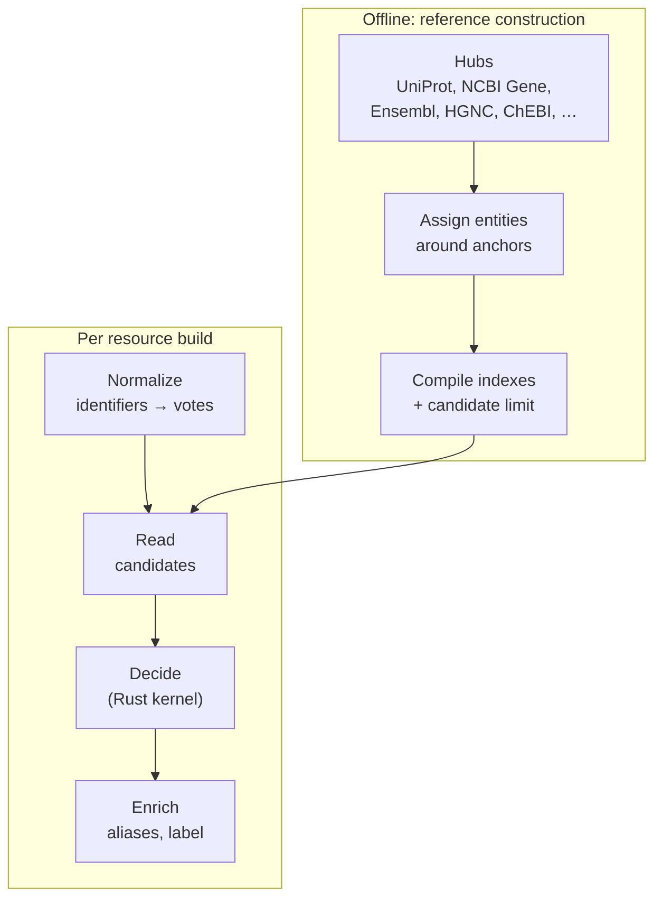

# Entity resolution

Resolution decides which entity a source observation refers to. It runs once,
during the resource build, before Parquet publication. The API, PostgreSQL and
the subsets never resolve again ([D1](decisions.md#d1)).

The guiding rule is **abstain rather than guess** ([D9](decisions.md#d9)). When the
evidence is missing, conflicting or ambiguous, the observation keeps its own
identifier. A wrong merge is worse than an unresolved entity, so a high
unresolved rate can be correct behaviour.

## Two phases

### Reference library

The [reference library](glossary.md#reference-library) is built offline from
normalized [hubs](glossary.md#hub). Entities are assigned around
[anchors](glossary.md#anchor): the full InChIKey for chemicals and the primary
UniProt accession for proteins. A separate gene component holds NCBI Gene
records and the gene–product links.

The result is an immutable **generation** with two LMDB indexes:

| Index | Maps | Used for |
| --- | --- | --- |
| identifier index | (target, route, namespace, identifier, optional taxon) → candidate entities | Lookup |
| entity index | entity ID → kind, anchor, taxon, label, all admitted identifiers | Enrichment |
| gene-role component | supported gene candidates and gene aliases | Gene identity |

A generation is published by switching the `current` symlink. Each build pins
one generation for its whole run and records it in its provenance. If a
required index or component is missing or damaged, the build fails instead of
falling back.

**Candidate limit.** If a lookup key has more than **10** candidates, the whole
key is removed from the runtime index and written to `ambiguous.parquet`. Lists
are never truncated, because a truncated list could produce a false unique
match. The limit applies separately to global and taxon-specific keys.

### Matching an observation

The entity type selects a policy ([`policy.py`](../packages/resolver/omnipath_resolver/canonical/policy.py)):

| Policy | Entity types | Library | Identifiers that vote |
| --- | --- | --- | --- |
| gene_protein | gene, protein, RNA/transcript | gene_protein | UniProt, Entrez, Ensembl (G/T/P), HGNC, RefSeq, GenBank, KEGG gene; gene symbols only with a taxon |
| chemical | chemical entity, small molecule | chemical | InChIKey, InChI, ChEBI, ChEMBL, PubChem, HMDB, KEGG, CAS, LIPID MAPS, SwissLipids, DrugBank, BiGG, MetaNetX, RefMet, RaMP, Goslin |
| cv_term, complex, generic | ontology classes, complexes, everything else | none | not matched; keep their own identifier |

Names and arbitrary annotations never vote.

The Rust kernel then decides:

1. Look up each vote and collect its candidate set.
2. **Intersect** all informative candidate sets.
3. Exactly one candidate → **unique**, accepted.
4. Empty intersection → **conflicting evidence**, abstain.
5. More than one → **ambiguous**, abstain.

For chemicals, a valid full InChIKey is the primary anchor: when present, only
the anchor decides and other identifiers cannot override it. A repeated primary
identifier does not outvote conflicting secondary evidence. Molecular SMILES
supplied by the source can be converted to a Standard InChI with RDKit first.

## Gene and product identity

Genes, proteins and transcripts are resolved as **two coordinated levels**
([D4](decisions.md#d4)–[D6](decisions.md#d6)):

- **Gene level**: NCBI Gene becomes the `reference_entity_key`.
- **Product level**: protein evidence resolves to a primary UniProt entry;
  specifically reported transcripts are kept. The product goes into the
  occurrence's `molecular_form`.

Rules that follow from this:

- A gene identifier never selects a protein, even when the gene has only one
  product. Gene evidence is never fanned out to products.
- A representative or reviewed protein chosen for display never becomes the
  asserted participant. Reviewed status does not break ties.
- Two UniProt entries that share a gene stay two distinct products.
- Product-to-gene links must be explicit and must agree with any GeneID the
  source supplied. Conflicts remain diagnosable.
- The source `entity_type` is never changed by resolution.

### Fallbacks

| Situation | Result |
| --- | --- |
| No match at all | The observation keeps its own primary identifier as a native entity |
| Protein reported but not in the catalogue | The exact reported product is kept (with version, isoform or chain suffix), marked `omnipath:protein_mapping_status = reported` |
| No unique gene can be established | The native product or source CURIE becomes the reference; `omnipath:gene_mapping_status` and `omnipath:gene_mapping_candidate` annotations explain why |
| No reference library available | All identities stay native |

## Grouping is not identity

Grouping happens at query time and does not change any stored key ([D10](decisions.md#d10)).

- **Biological entities** group by `reference_entity_key`, so protein, gene and
  RNA rows of TP53 appear together while keeping their own types.
- **Chemicals** group by **connectivity**: the first 14-character block of the
  InChIKey. Stereoisomers and charge states appear together, but stay distinct
  entities.

The explorer has one Group toggle that applies both rules.

## Where the code is

| Concern | Location |
| --- | --- |
| Hubs and reference construction | `packages/build/omnipath_build/reference/` |
| Runtime matcher and policies | `packages/resolver/omnipath_resolver/canonical/` |
| Decision kernel | `packages/resolver/rust/reference/src/lib.rs`, `packages/resolver/src/precomputed.rs` |
| Detailed design and measurements | [`docs/reference-resolver.md`](../docs/reference-resolver.md) |
