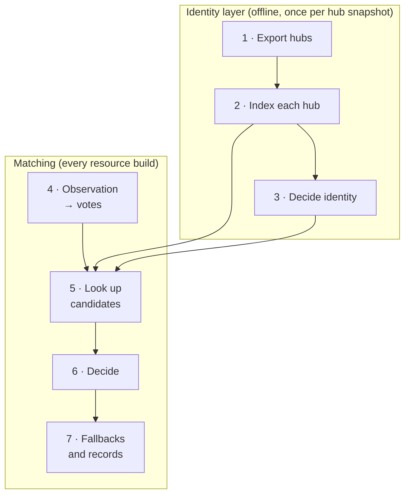

# Entity resolution

Resolution decides which entity a source observation refers to. It has two
parts. First, the **identity layer** is built offline from identifier hubs: it
decides once which hub records form which entity. Then, during every resource
build, **matching** looks up each observation's identifiers and decides whether
exactly one entity is supported.

> **Decision: resolve once, at build time.** Resolution runs inside the
> resource build, before Parquet publication. The API, PostgreSQL and the
> subsets use the published identities and never resolve again.
> *Why:* one place owns identity, so every consumer sees the same entities.
> A change to resolution rules therefore needs a new resource version.

> **Decision: abstain rather than guess.** When evidence is missing,
> conflicting or ambiguous, the observation keeps its own identifier.
> *Why:* a false merge silently corrupts every downstream result, while an
> unresolved entity is visible and fixable. Judge resolution by correctness
> first and coverage second. A high unresolved rate can be correct.



## 1. Hubs

A **[hub](glossary.md#hub)** is a normalized export of one reference database.
Every row says *this record of the hub carries this identifier*:

| Field | Meaning | Example |
| --- | --- | --- |
| `hub_id` | The hub's own record | `15377` in the ChEBI hub |
| `source_type`, `source_id` | An identifier attached to that record | `inchikey`, `XLYOFNOQVPJJNP-UHFFFAOYSA-N` |
| `taxonomy_id` | Organism of the record; `0` for chemicals | `9606` |
| `backend` | Where the mapping came from | the providing download |

| Domain | Hubs |
| --- | --- |
| Chemical | ChEBI, PubChem, ChEMBL, HMDB, LIPID MAPS, SwissLipids, BiGG, MetaNetX, RefMet, RaMP |
| Gene and protein | UniProt, NCBI Gene, RaMP genes, plus Ensembl gene mappings and UniProt's RefSeq and EMBL-CDS sequence mappings |
| Reaction | Rhea (master reactions, directions, Rhea's own cross-references), MetaNetX reactions |
| Ontology terms | GO, ChemOnt, HPO, MONDO, PSI-MI: term names only, never matched |

The miRBase hub is exported but not used for resolution yet.

```bash
omnipath-build export-hubs --output-dir data/reference/hubs --max-records 0
```

## 2. Hub indexes

Each hub is indexed on its own, independent of the identity rules, so a hub is
re-indexed only when its export changes
([`hubindex.py`](../packages/build/omnipath_build/identity/hubindex.py)):

| File | Content |
| --- | --- |
| `records.parquet` | One row per record: its anchor, if it has exactly one, and how many anchors it claims |
| `by_id/` | Lookup rows: identifier → record, tagged `native`, `claim`, `secondary` (UniProt secondary accession), `symbol_synonym` or `version_stripped` |
| `by_record/` | Every normalized row of a record, including names and structures that feed labels |
| `xrefs.parquet` | The cross-references between records, the only input the identity decisions read |
| `kv/` | LMDB point-lookup stores of `by_id` and `by_record`, read by matching |

- **Anchors** are identifiers that define identity on their own: a valid full
  InChIKey (the empty-structure InChIKeys are ignored), the UniProt record's own
  primary accession, the NCBI GeneID and the Rhea master reaction.
- **Lipid names.** The chemical hubs (SwissLipids, LIPID MAPS, HMDB, ChEBI,
  RefMet) also get `goslin` rows: each record's names are parsed with Goslin,
  and the most specific parse at species level or finer is kept, through a
  persistent parse cache.

```bash
omnipath-build build-hub-index --hub chebi --hubs-dir data/reference/hubs --output-root data/reference/hub-index
omnipath-build build-hub-kv --hub chebi --hub-index-root data/reference/hub-index
```

## 3. Identity decisions

`build-identity` decides every record that is not simply its own anchor's
entity ([`decisions.py`](../packages/build/omnipath_build/identity/decisions.py)).
It is plain DuckDB SQL plus an in-process union-find for grouping, and runs in
minutes.

| Domain | Anchor | Entity ID |
| --- | --- | --- |
| Chemical | Full InChIKey | `inchikey:XLYOFNOQVPJJNP-UHFFFAOYSA-N` |
| Lipid without a structure | Goslin name, species level or finer | `goslin:species:PC 34:1` |
| Protein | Primary UniProt accession | `uniprot:P04637` |
| Gene | NCBI GeneID | `entrez:7157` |
| Reaction | Rhea master reaction | `rhea:10000` |

Each record gets one decision:

| Decision | When | Entity |
| --- | --- | --- |
| (none) | The record has exactly one anchor | That anchor |
| `quarantined` | The record claims two or more anchors | Its own; it never connects anything |
| `lipid_name` | A chemical without an InChIKey whose most specific Goslin name is unique | `goslin:<level>:<name>` |
| `attached` | An anchorless record whose own cross-references reach records with exactly one anchor, none of them quarantined | That anchor |
| `grouped` | Anchorless records with no cross-reference to an anchored record, connected through their cross-references, at most one record per hub | The record of the preferred hub |
| `ambiguous_native` | The cross-references reach several anchors, or a group holds two records of one hub | Its own |
| `structureless` | An anchorless record with no usable cross-reference | Its own |

- **One step only.** Attachment looks at a record's own cross-references.
  Chains are never followed, so two anchors can never be merged through
  intermediate records.
- **Preferred hub** for a group's ID: ChEBI, LIPID MAPS, SwissLipids, HMDB,
  ChEMBL, PubChem, KEGG, MetaNetX, BiGG, RefMet, RaMP, then the lowest local ID.
- **Gene–product links.** UniProt ↔ NCBI Gene cross-references are not
  identity edges. A protein is linked to a gene when either hub states the link,
  the protein has a single anchor and the taxa agree. Genes never join proteins
  to each other.
- **Lipid structures.** A full-structure Goslin name leads to an InChIKey only
  when every record carrying that name and an InChIKey agrees on exactly one.

The output is an `omnipath-identity-v2` library (about 2 GB): the decisions,
gene–product links, lipid name → InChIKey pairs, the anchors each quarantined or
ambiguous record points to, and ontology term labels, plus LMDB stores for
matching. Its directory name is a fingerprint of the hub indexes and the rules
code, and every resource build records the fingerprint it used.

```bash
omnipath-build build-identity --hub-index-root data/reference/hub-index --output-dir data/reference/identity
```

`build-identity` writes the LMDB stores too. `make reference` runs the hub
indexes, their stores and this step for every hub
([identity layer guide](../packages/build/REFERENCE.md)).

**Example.** A ChEBI record with InChIKey *K* becomes entity `inchikey:K`. An
HMDB record without a structure that cross-references only that ChEBI record
is attached to `inchikey:K` too. A MetaNetX record without a structure that
cross-references two records with different InChIKeys stays its own entity,
because choosing either would be a guess.

> **Decision: anchors define identity; cross-references only attach.**
> Records join an entity only through a one-step, unambiguous path to one
> anchor.
> *Why:* cross-references between chemical databases are often many-to-many.
> Letting them merge anchored entities would chain unrelated structures together.

## 4. From observation to votes

Matching starts from a mapped source entity: its type, primary identifier,
other identifiers, taxon and molecular form
([`match.py`](../packages/resolver/omnipath_resolver/canonical/match.py)).

The **entity type selects a policy**
([`policy.py`](../packages/resolver/omnipath_resolver/canonical/policy.py)):

| Policy | Entity types | Identifiers that vote |
| --- | --- | --- |
| gene_protein | gene, protein, RNA and transcript types | UniProt (primary, secondary, entry name), NCBI Gene, Ensembl gene/transcript/protein, HGNC, RefSeq, GenBank, KEGG gene, RaMP gene; gene symbols only with a taxon |
| chemical | chemical entity, small molecule | InChIKey, InChI, ChEBI, ChEMBL, PubChem, HMDB, KEGG, CAS, LIPID MAPS, SwissLipids, DrugBank, BiGG, MetaNetX, RefMet, RaMP, Goslin |
| reaction | molecular activity | Rhea; KEGG, MetaCyc, EcoCyc, Reactome and M-CSA reactions through Rhea; BiGG, VMH, SEED and SABIO-RK reactions through MetaNetX |
| cv_term, complex, generic | ontology classes, complexes, everything else | none: never matched, keep their own identifier |

Each identifier is normalized and becomes a **[vote](glossary.md#vote)** when its
namespace is allowed:

- Namespaces and identifiers are normalized first. RefSeq accessions are typed
  by prefix (`NP_` protein, `NM_` transcript) and looked up without version;
  the exact version stays in the molecular form.
- For genes and proteins, the specific isoform and sequence identifiers in the
  molecular form vote as well.
- A chemical without an InChIKey but with an explicit SMILES gets a Standard
  InChIKey derived with RDKit, which votes like any other identifier.
- **Lipid names.** When a chemical has no other usable identifier, its names and
  synonyms are parsed with Goslin, and each name at the most specific level
  votes. A RefMet ID alone does not count as usable, since it can stand for an
  underspecified lipid.
- Other names, synonyms and annotations never vote.
- **miRNAs** are RNA types, so gene identifiers they carry (NCBI Gene, Ensembl)
  vote under the gene_protein policy. miRBase accessions and names do not vote
  yet, and `resolution_stats.json` counts miRNAs as `not_applicable`.

## 5–6. Looking up and deciding

Each vote's key is looked up in the hub and identity stores
([`identity_runtime.py`](../packages/resolver/omnipath_resolver/identity_runtime.py)).
There is no candidate limit: a key contributes every candidate, and the
intersection decides.

- **Precedence within one key.** A record's own identifier beats a fallback
  row, a primary UniProt accession beats secondary-accession claims for the same
  string, and an exact gene symbol beats a symbol synonym in the same taxon.
- **Quarantined and ambiguous records** vote for every anchor they point to, so
  the other identifiers can still decide.
- **Lipid structures.** A full-structure Goslin name only reaches an InChIKey
  entity through the unique pairs from step 3.

The candidate sets then go to the Rust decision kernel
([`lib.rs`](../packages/resolver/rust/reference/src/lib.rs)):

1. **Chemicals with a stated structure.** If the source states a valid full
   InChIKey, only the InChIKey decides; other identifiers cannot override it.
2. **Intersect** the candidate sets of all participating votes.
3. **Decide:**

   | Surviving candidates | Outcome | Result |
   | --- | --- | --- |
   | exactly one | unique | Accepted |
   | none | conflicting evidence | Abstain |
   | more than one | ambiguous | Abstain |
   | no vote found anything | not found | Abstain |
   | the candidate is quarantined | quarantined | Abstain |

A repeated identifier does not outvote conflicting evidence: one disagreeing
vote empties the intersection.

**Chemical fallbacks.** A chemical that was not accepted is decided again on
narrower evidence, in order; the first unique answer wins, and an accepted
result never changes:

1. Without coarse cross-references (KEGG, BiGG and MetaNetX compounds), which
   must not veto the source's specific identifiers.
2. On the source's own structure (a stated InChIKey or one derived from its
   SMILES), when its identifiers contradict each other.
3. When every candidate is one molecule in different protonation states
   (InChIKeys equal but for the last character): on the neutral form if the
   source names it, else on the primary identifier.

### Gene and product level

Gene, protein and RNA observations are decided on **two levels at once**
([`precomputed.rs`](../packages/resolver/src/precomputed.rs)):

- **Gene level.** Each vote contributes the genes of its candidates: directly
  for gene candidates, or through explicit gene links for products. A vote whose
  candidates are not all linked contributes no gene evidence. GeneIDs supplied
  by the source further constrain the result. The gene sets are intersected.
- **Product level.** Only votes that identify a product contribute, and only
  primary UniProt entries count. Gene identifiers and symbols never contribute
  here, so a gene vote can never select a protein, even when the gene has only
  one product. A product is chosen only when exactly one survives, nothing
  conflicts and it is not quarantined.

| Gene status | Meaning | `reference_entity_key` |
| --- | --- | --- |
| `resolved` | exactly one gene | `entrez:<GeneID>` |
| `ambiguous` | several genes | native fallback |
| `conflict` | the votes disagree | native fallback |
| `missing` | no gene evidence | native fallback |

Any status other than `resolved` is kept on the evidence as
`omnipath:gene_mapping_status`, with `omnipath:gene_mapping_candidate` listing
the candidates.

**Examples** (illustrative):

| Observation | Gene | Product | Entity row |
| --- | --- | --- | --- |
| protein · `uniprot:P04637` + GeneID 7157 | resolved `entrez:7157` | `uniprot:P04637` | protein, `entrez:7157` |
| protein · symbol `TP53`, taxon 9606 | resolved `entrez:7157` | none (symbols never select a product) | protein, `entrez:7157`, no product in the form |
| gene · `ENSG00000141510` | resolved `entrez:7157` | not applicable | gene, `entrez:7157` |
| protein · `uniprot:P04637` + GeneID 672 (BRCA1) | conflict | `uniprot:P04637` | protein, native `uniprot:P04637` reference, status `conflict` |

> **Decision: NCBI Gene is the shared reference for genes and products.**
> Wherever a supported mapping exists, `reference_entity_key` is the GeneID,
> for gene, protein and RNA records alike.
> *Why:* people browse by gene. One reference collects knowledge about a gene's
> products without merging the products. (4 October 2026)

> **Decision: gene evidence never selects or fans out to proteins.** Protein
> identity is resolved separately to primary UniProt and kept in the
> occurrence's molecular form. A representative or reviewed protein is never
> used as the participant, and reviewed status does not break ties.
> *Why:* copying gene evidence onto every product of a gene invents claims that
> no source made. (4 October 2026)

### Reactions

A reaction's anchor is its Rhea master reaction, which has no direction. A
directional Rhea ID resolves to its master; the reported direction stays on the
occurrence. Rhea's own cross-references win over MetaNetX's for the same ID.
Model-reaction IDs (BiGG, VMH, SEED, SABIO-RK) resolve through a MetaNetX
reaction, which attaches to a Rhea master under the rules of step 3 or stays
its own entity. Compartment and transport stay on the occurrence; EC numbers
are not used for identity.

## 7. Fallbacks and entity records

An accepted entity's record (label, taxon, identifiers, gene links) is
assembled from the hub stores on first use and cached per identity
fingerprint, so a cached record equals a freshly built one. During resource
builds this is deferred to the finalizer, which attaches identifiers once per
entity instead of once per observation. Isoform, transcript and sequence
identifiers stay on the occurrence's molecular form.

| Situation | Result |
| --- | --- |
| No match | The observation keeps its own normalized primary identifier as a native entity |
| Chemical not resolved, but with exactly one valid InChIKey | That InChIKey becomes its identity |
| Protein reported but not resolved | The exact reported product is kept (with version, isoform or chain suffix), marked `omnipath:protein_mapping_status = reported` |
| No unique gene | The native product or source identifier becomes the reference, with the gene mapping status |
| Ontology term cited by ID only | It keeps its ID and is named from the ontology hub |
| No identity library available | All identities stay native |

Every build writes `resolution_stats.json`: unique observed entity keys per
entity type and outcome (`resolved`, `structure`, `unresolved`,
`not_applicable`) and per deciding rule. These count observations, not final
entities.

## Grouping is not identity

Grouping happens at query time and does not change any stored key.

- **Biological entities** group by `reference_entity_key`: protein, gene and RNA
  rows of TP53 appear together while keeping their own types.
- **Chemicals** group by **[connectivity](glossary.md#connectivity)**, the first
  14 characters of the InChIKey: stereoisomers and charge states appear together
  but stay distinct entities.

> **Decision: grouping is a query-time view.** The explorer has a single Group
> toggle that applies gene grouping to biological records and connectivity
> grouping to chemicals.
> *Why:* the same data needs both an exact and a grouped view, and the stored
> identities must not depend on the view.

## Where the code is

| Concern | Location |
| --- | --- |
| Hub exports | `packages/build/omnipath_build/hubs/` |
| Hub indexes and LMDB stores | `packages/build/omnipath_build/identity/hubindex.py`, `identitykv.py` |
| Identity decisions | `packages/build/omnipath_build/identity/decisions.py` |
| Lookup, fallbacks and entity records | `packages/resolver/omnipath_resolver/identity_runtime.py` |
| Policies and matcher | `packages/resolver/omnipath_resolver/canonical/` |
| Decision kernel | `packages/resolver/rust/reference/src/lib.rs`, `packages/resolver/src/precomputed.rs` |
| Regression against another library | `packages/build/omnipath_build/regression/` |
| Rules in detail | [`docs/identity-layer-spec.md`](../docs/identity-layer-spec.md) |
