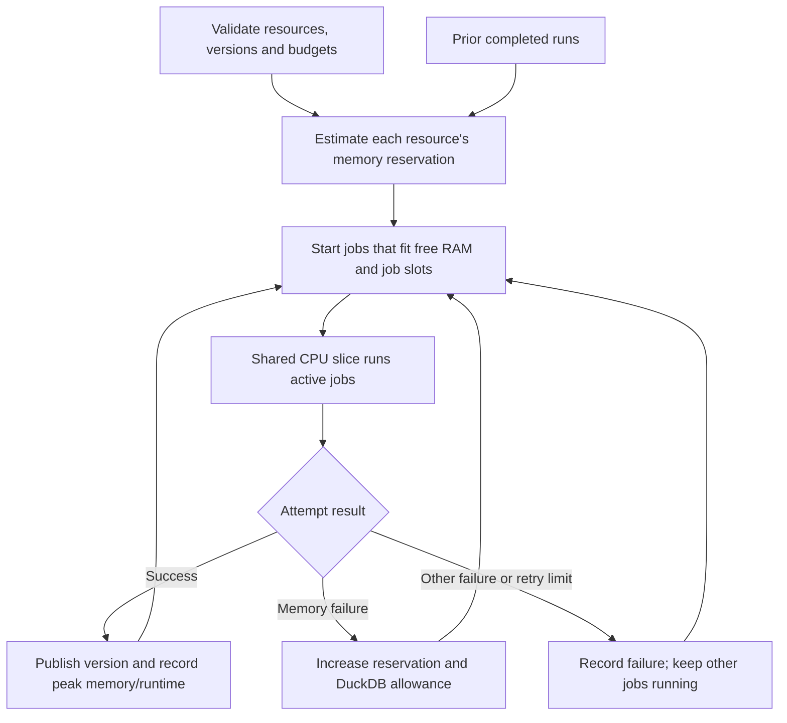

# Budgeted resource orchestration

`omnipath-build run` schedules independent resource builds in isolated processes.
Select resource names or `--all`, supply immutable versions, and set the shared
worker RAM and CPU budget. The existing `build` command remains a direct build
interface; use `run` when you want scheduling and enforced resource limits.

The CLI defaults to **one resource at a time**, using two phases. With six CPUs,
up to six workers independently extract, resolve and append private observation
shards. They exit before one finalizer imports the shards, aggregates globally
and writes final Parquets using all six SQL threads. Six CPUs is a ceiling;
parsing, small inputs and I/O can still leave capacity idle.

`--jobs N` explicitly enables concurrent resources, dividing the CPU allowance
between them. This division is fixed for the run rather than dynamically lending
idle slots across resources. The Python `Budget.jobs=None` API retains its earlier
resource-concurrency default; the CLI passes `jobs=1` explicitly.

## Examples

```bash
# Selected resources, bounded sample per dataset
python -m omnipath_build.cli run chembl signor \
  --version 2026.9.6.108 --max-records 100000 \
  --ram 10GiB --cpus 8 --output-dir data

# Every discoverable resource, no row limit
python -m omnipath_build.cli run --all \
  --versions resource-versions.json --ram 10GiB --cpus 8 --output-dir data

# Continue a batch without rebuilding completed immutable versions
python -m omnipath_build.cli run --all \
  --versions resource-versions.json --ram 10GiB --cpus 8 \
  --skip-existing --output-dir data
```

`--sources chembl signor` is equivalent to positional resource names. A single
`--version` applies to every resource; `--versions` supplies per-resource overrides.
No global serving release is published. `--max-records` applies **per dataset**.
Omitting it permits unrestricted resource builds, including their normal parser
and cache preparation behavior.

## CPU headroom and enforcement

The scheduler **always excludes at least one available logical CPU** from builds.
`--reserve-cpus N` can reserve more, but cannot be zero. It uses the calling
process's CPU affinity to determine which CPUs are available, then clamps the
requested budget to `available - reserve`. An 8-CPU machine with `--cpus 8`
therefore runs the build on at most **7 CPUs**. A machine with no spare CPU is
rejected. The final effective CPU IDs and count appear in `summary.json`.

On Linux, the default `systemd` executor creates a unique runtime slice with:

- `AllowedCPUs`: only the selected logical CPUs;
- `CPUQuota`: the effective shared CPU-time ceiling;
- `MemoryMax`: the total worker memory budget;
- `MemorySwapMax=0`: workers cannot extend that budget by swapping.

Each attempt runs in its own scope with a separate `MemoryMax` reservation and
`OOMPolicy=kill`. Child processes inherit the scope's limits. A killed worker
cannot leave its downloader or parser subprocesses outside the reservation.
CPU shares are equal, without a fixed per-worker CPU quota. DuckDB's thread
allowance is divided by the configured resource concurrency. Each preparation
worker uses one SQL thread; the finalizer can use the full resource CPU allowance. Common native math libraries use one
thread. Quotas are CPU-time limits; `AllowedCPUs` additionally prevents workers
from briefly occupying every host CPU.

This requires Linux cgroup v2, systemd, and permission to create scopes/slices.
Root works on nicesrv. `--user` uses the user systemd manager and requires delegated
memory and CPU controllers. Failure to establish limits stops the run; it does
not silently switch to unenforced execution. Temporary units and runtime slice
settings are removed after completion or normal cancellation.

The limits cover build workers, their subprocesses and their charged filesystem
cache. The scheduler console/controller itself runs outside that worker slice,
so allow some additional host memory for it and for other services. CPU headroom
excludes builds from those logical CPUs; it does not exclusively reserve physical
cores or prevent other host processes from using the build CPUs.

`--executor local` is **advisory development mode**, intended for macOS/local
checks. It uses the same admission rules and process cleanup, but cannot provide
the Linux cgroup ceilings. Its console explicitly says limits are advisory.

## How jobs are selected

### Two-phase preparation and finalization

The parser snapshots source rows to bounded private disk tasks. Up to twice the
worker count may be queued. Tasks contain at most 8,192 rows (or a smaller
`--batch-size`) and at most 128 MiB serialized input (or a smaller calculated RAM
share). These are work units for scheduling, not per-worker memory reservations.

Each reusable preparation worker owns a compact-index resolver, DuckDB observation
database and dictionary-encoded payload output. Workers span dataset boundaries;
only mapping code is dataset-specific. They flush after 5,000 observed entities
or relations, or a bounded byte estimate. One oversized source row is indivisible.
Worker count is bounded by CPU capacity and a coarse 1 GiB reservation per worker.
Each worker SQL connection gets RAM/(8 × workers), bounded to 64–512 MiB.
Memory retries reduce preparation concurrency, giving each remaining worker more
headroom inside the total reservation.
The cgroup is the hard limit for the whole resource including parent and children.

After all workers exit, the finalizer imports flat tables, remapping per-shard
event IDs to prevent evidence collisions. It merges resolution statistics by
unique observation keys, reads reference aliases once from the entity index, and performs the
existing partitioned aggregation. Evidence dictionaries remain encoded during
shard concatenation. The finalizer's DuckDB connection receives 80% of reserved
RAM, leaving space for Python/Arrow inside the same cgroup; it can use all assigned
CPUs. Resource manifests record `parallel-shards-v1` and phase timings.

Failures/cancellation reap children and remove private staging files. Publication
remains atomic, with checksums and resolution statistics; successful versions are
immutable. Retries restart the resource, since shard checkpoints are not durable.
Two-phase preparation is the only supported resource processing path.
`build_resource(..., batch_workers=1)` uses the same shards and finalizer with one
preparation worker; zero workers is rejected.



New resources start with `--worker-ram 4GiB`, clipped to the total budget.
Successful history supplies subsequent estimates, including peak memory, runtime
and a working DuckDB allowance. History is keyed by resource and record limit;
a 100k sample does not determine the reservation for an unrestricted build.
Reservations include a safety margin above measured peak memory and a floor for
DuckDB working space. Reference/input changes can still make estimates inaccurate.

The scheduler starts the longest previously measured jobs first and backfills
smaller jobs that fit, rather than letting a large queued job block the entire
queue. Reservations never sum to more than `--ram`. The concurrent job count is
bounded by effective CPUs and optional `--jobs`.

This is a practical scheduling heuristic, not a guarantee of a mathematically
optimal schedule. First-time jobs have unknown requirements; memory reservations
may leave RAM unused, and parsing, downloads or disk I/O may leave CPU idle.
CPU time is shared immediately by the kernel; memory estimates improve across
completed runs rather than being speculatively overcommitted during a run.

You can supply initial resource reservations explicitly:

```json
{
  "chembl": {"ram": "8GiB"},
  "signor": {"ram": "2GiB"}
}
```

Pass this file with `--profiles profiles.json`. Requests larger than the total
budget are rejected before work starts. These are initial reservations; memory
retries may increase them up to the total budget.

## Failures, retries and publication

A DuckDB/Python memory exception or a cgroup OOM kill triggers a retry with a
larger reservation, up to the total RAM ceiling, and reduced preparation
concurrency. The finalizer derives its SQL budget from that reservation. A retry
is skipped if neither the reservation nor worker count can change.
The default is at most two retries (`--max-retries`). If a larger attempt cannot
fit alongside current work, it waits for enough memory. Other failures are
recorded and independent resources continue.

Each attempt builds inside its own directory. The scheduler holds the real
resource-version lock and moves only a successfully completed version into
`resources/<source>/<version>`. Failed/cancelled attempts cannot publish partial
resources or remove another process's version lock. Existing complete versions
require `--skip-existing`; partial or mismatched versions are not silently skipped.

Ctrl-C and SIGTERM stop admission, request worker cancellation, then terminate
remaining worker groups after a short grace period. Completed versions remain
usable. Attempt output/temp directories are removed, while logs and diagnostics
remain. A SIGKILL or machine crash can bypass cleanup: retained run directories
and owned version locks may then require inspection before rerunning.

The CLI also defaults to a **20 GiB free-disk reserve** (`--min-free-disk`). If
free space under the output root drops below it, the scheduler stops admission
and cancels workers, retaining completed versions and diagnostic logs. This guards
against filling the host filesystem; it is not a disk quota or a guarantee about
writes made between monitoring polls. Python callers can set `min_free_disk` in
bytes (default zero for the API).

## Console and durable logs

An interactive terminal displays a compact live dashboard with running resources,
stage progress bars, actual/reserved RAM, CPU use, queue size and completion counts.
Bars describe the current reported pipeline stage, not an estimated whole-build
percentage. Redirected output uses throttled timestamped lines without terminal
control codes. Noisy parser/dependency output goes to per-attempt logs.

```text
<output-dir>/
├── .build-history.json             # learned estimates, merged across runs
├── .build-history.lock
└── .build-runs/<timestamp-id>/
    ├── summary.json                # latest state and final results
    └── <source>/attempt-<number>/
        ├── spec.json               # exact worker settings
        ├── events.jsonl            # pipeline progress events
        ├── console.log             # worker stdout/stderr and tracebacks
        └── result.json             # result or caught exception, if worker survived
```

Run summaries include attempts, final states, reservation/peak memory and output
paths. A kernel-killed process may not write `result.json`; the scheduler still
records its failure. Exit codes are `0` for success (including skipped versions),
`1` for failed jobs/setup and `130` for cancellation.

Python callers can use `orchestrate(sources, budget=Budget(...), ...)` from
`omnipath_build`, with `on_progress` snapshots and `should_cancel` hooks.
`Budget.ram` and `Budget.worker_ram` use integer bytes. See
[the pipeline guide](README.md) for underlying build and identity semantics.

## Validation

The test suite covers admission/backfilling, CPU headroom, subprocess execution,
memory retries, skipping completed versions, lock ownership, cancellation,
child-process cleanup and plain console output. On a permitted Linux host:

```bash
OMNIPATH_TEST_SYSTEMD=1 python -m pytest \
  packages/build/tests/test_orchestrator.py -q
```

That opt-in test deliberately exhausts a small worker cgroup to check actual
kernel enforcement and retry behavior while another resource completes.
