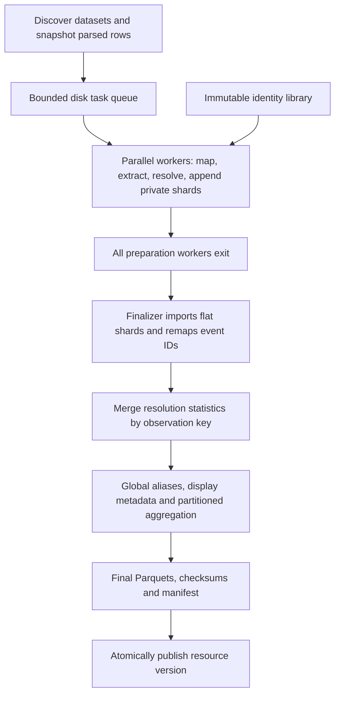

# Resource build pipeline

The resource builder streams `pypath.inputs_v2` datasets into the normalized
Parquet tables of `omnipath_core.schema`. It uses one implementation: batched
entity resolution and flat DuckDB working tables, followed by one final aggregation
into the published and serving tables.

## Data flow



### 1. Read and extract

`pipeline.py` discovers datasets with `discovery.py`, snapshots each parsed
source row before mapping, and passes mapped entities and relations to
`SilverExtractor` in `silver.py`, running in preparation workers. Dataset-qualified row locators identify
individual evidence occurrences. When a dataset does not expose parsed rows,
the payload contains the mapped record instead; the manifest records this origin.

The extractor preserves identifiers, attributed annotations, quantitative
values, nested membership, ontology context and raw payload links. A batch is
flushed when any configured threshold is reached, and at each dataset boundary.
The source row limit applies separately to each dataset.

### 2. Resolve identities

`EntityResolver` in each worker locates the same immutable reference library and records resolution statistics.
`omnipath_resolver.canonical.match` implements the single `LibraryMatcher` algorithm:

1. Normalize identifiers using the entity policy. Allowed identifiers become
   votes; symbol votes require a taxon. Names and arbitrary annotations do not vote.
2. Read complete candidate postings. An independent gene component admits
   direct gene claims and aliases from explicitly, uniquely linked products;
   its cutoff counts distinct supported genes rather than catalogue proteins.
3. Resolve gene identity and any asserted protein identity separately, checking
   their explicit links and source-supplied GeneIDs. Gene evidence cannot select
   or expand onto catalogue proteins. Distinct primary UniProt entries remain
   distinct even when they share a gene.
4. Preserve the source type, product ambiguity, conflicts and specific sequence
   versions. Missing catalogue products retain the exact reported product where
   supplied; unknown information does not assert a canonical or unmodified form.
5. Chemical observations use the existing identity decision policy.

A repeated primary identifier does not override conflicting secondary evidence.
Protein and gene observations can share an NCBI Gene reference while retaining
separate typed entity keys. See [canonicalization](../resolver/omnipath_resolver/canonical/README.md).

The build requests `defer_aliases=True`: the finalizer attaches reference aliases
and labels from the base entity index plus the verified gene-record component.
Sequence-specific identifiers remain on their molecular occurrence rather than
entering a generic entity's alias collection. Component identity is included in
build provenance. The first reader in each process verifies its checksums;
subsequent readers reuse proofs only while file identity and timestamps match.

### 3. Append flat observations

Each preparation worker owns a private `ParquetWriter.append_observations(extractor, resolver)`.
It resolves the batch, registers Arrow columns and appends narrow working tables:
entities, identifiers, entity annotations, relation occurrences, relation
annotations, and reference node links.

SQL computes canonical entity keys, remaps endpoints and payload links, and
orients symmetric relations consistently. Shared identity functions validate
predicates and qualifiers; ontology context remains part of statement identity.
When a symmetric relation flips, subject/object annotation scopes flip with it.
Payload JSON stays outside SQL: joins remap only its narrow evidence references.
The writer constructs Arrow dictionary arrays directly from distinct JSON values,
then writes Parquet groups bounded separately by 64 MiB of conservatively
estimated distinct JSON bytes, 64 MiB of narrow references, and 65,536 rows. A
single oversized source record is indivisible; its repeated references stay in
the same group until the reference or row cap is reached.
Each group's dictionary stores shared JSON once; evidence rows retain individual
references, including duplicates. Dictionaries may repeat across groups. The
public `payload_json` string column and evidence schema stay unchanged, so existing
readers need no migration. Progress callbacks distinguish evidence writing from
resolution.

There is no separate Python consolidation stage and no nested intermediate
entity/relation chunk format.

### 4. Finalize once

Preparation workers seal unaggregated shards and exit. The finalizer imports
their flat tables, offsets event IDs to prevent collisions, concatenates dictionary
evidence, and merges resolution statistics by unique observation key.

`ParquetWriter.close()` reads allowed reference aliases for distinct node links
from the entity index. It chooses global entity display metadata and counts distinct ontology
parent/child edges, then attaches endpoint labels, types and taxon while relation
rows are still flat. Ordinary membership relations do not create ontology counts.

Rows are bucketed by key prefix, in key order. Each bucket numbers its entities and
relations (`entity_id`, `relation_id`) and writes their rows and child rows, so
every table is sorted by its key or parent id:

- Identifiers and entity/relation summary annotations are deduplicated with their
  provenance. Canonical flags are combined for otherwise identical identifiers.
- Evidence is a **multiset**: independent occurrences, including identical ones,
  remain separate. Annotation order within an evidence occurrence is preserved.
- Labels and taxon fields are deterministic display projections. Original
  attributed assertions remain available; a chosen taxon does not settle a
  conflict in source assertions.

Aggregation remains necessary because observations and aliases repeat across
batches. Doing it once over flat tables avoids repeatedly building, unpacking and
merging nested Python objects. Bucketing limits aggregate working sets but
cannot make an exceptionally large single entity or relation cost-free. The
serving tables (`relation_endpoint`, `entity_group`, `entity_term`) are written
last, each sorted by its lookup key.

## Output and publication

```text
resources/<source>/<numeric-version>/
├── entity.parquet, entity_identifier.parquet, entity_annotation.parquet,
│   entity_evidence.parquet
├── relation.parquet, relation_annotation.parquet, relation_evidence.parquet
├── evidence_payloads.parquet
├── relation_endpoint.parquet, entity_group.parquet, entity_term.parquet
├── resolution_stats.json
└── build_manifest.json
```

Schemas are defined in `omnipath_core/schema.py`. Statistics count unique observed entity keys
by entity type and matching rule; these are not final canonical entity counts.
The manifest includes checksums, processing/schema versions, execution strategy
(`parallel-shards-v1` for normal builds), batch limits, DuckDB settings and payload origins.

`build_resource` builds in a temporary staging directory and publishes the
complete version atomically. Existing resource versions cannot be overwritten.
A resource build does not itself publish a new global serving release or run its
derived filtering tables. See [version validation](omnipath_build/versioning.py).

## Budgeted orchestration

Use `python -m omnipath_build.cli run chembl signor --version 1.0.0 --ram 10GiB --cpus 8`
to schedule isolated resource processes under shared worker limits. At least one
host CPU is always excluded. The scheduler reserves memory, backfills the queue,
retries memory failures, learns from completed runs and displays console progress.
See the [orchestration guide](ORCHESTRATION.md) for `--all`, configuration, Linux
enforcement, retry behavior and durable logs.

## Running a build

```bash
python -m omnipath_build.cli build chembl \
  --version 1.0.0 --max-records 20 --output-dir data --memory-limit 1GB

python -m omnipath_build.cli build --sources signor chebi \
  --versions resource-versions.json --output-dir data --parallel 1
```

The versions JSON maps source names to numeric versions. Omit `--max-records`
for an unrestricted resource build. Reference library discovery uses an explicit
Python `library_dir`, then `OMNIPATH_LIBRARY_DIR`, then
`<output-dir>/reference/library`. Missing libraries leave identities unmatched.

| Control | Default | Scope |
|---|---:|---|
| `--batch-size` / `batch_size` | 50,000 | Entity ceiling; preparation caps it at 5,000 |
| Python `max_batch_records` | 50,000 | Record ceiling; preparation caps it at 8,192 |
| Python `max_batch_relations` | 50,000 | Relation ceiling; preparation caps it at 5,000 |
| Python `max_batch_bytes` | 256 MiB | Estimated byte ceiling; preparation caps it at 64 MiB and its RAM share |
| `--memory-limit` / `duckdb_memory_limit` | Environment, then 1GB | Finalizer SQL budget for direct builds; scheduled builds use 80% of reserved RAM |
| `OMNIPATH_BUILD_DUCKDB_MEMORY` | 1GB | Default DuckDB budget |
| `OMNIPATH_BUILD_DUCKDB_THREADS` | 4 | Direct-build CPU allowance; preparation SQL uses one thread per worker |
| `--parallel` | 1 | Resource workers |
| `TMPDIR` | Platform default | Matcher temporary databases/projections |

The thresholds are checked after a record, so one large record can exceed them.
DuckDB memory limits do **not** cap total process RAM: Arrow, Python, buffers and
concurrent connections also consume memory. Parallel resource workers multiply
these costs. Writer tables/spill live under the staged output's `.bulk/` directory;
matcher temporary files follow `TMPDIR`. Use a disk-backed temporary directory
when RAM-backed temporary storage would compete with the build. Temporary working
files are removed on normal close. A killed process may leave temporary artifacts.

## Tests and profiling

```bash
python -m pytest packages/build/tests packages/core/tests -q
```

Tests cover matching rules, fixed pre-removal regression fixtures, batch/order
invariance, evidence multiplicity, quantitative annotations, ontology context,
payload integrity and atomic publication. Build manifests record phase timings;
use orchestrator cgroup metrics for aggregate RAM measurements.

The old backend selector, `Consolidator` and `StreamingParquetWriter` APIs have
been removed. Use `build_resource` for normal builds or `ParquetWriter` for direct
Silver observation batches. ChEMBL parser/cache preparation is unchanged.

Two-phase processing is the only ingestion implementation. One preparation worker
uses the same path as multiple workers; `batch_workers=0` is rejected. The old
serial branch, extraction-only pool and experimental benchmark runners have been
removed. Run benchmarks through `build_resource` or the orchestrator to measure
the production implementation.


## Publication and public interfaces

Use `BuildConfig` with `build_resource(..., config=...)` for typed build settings;
existing keyword options are validated through the same configuration. Worker
outputs implement `ObservationShard`, `WorkerResult` and `BuildResult`. Resolution
outcomes are tracked in a bounded SQLite cache and streamed into Parquet shards;
the finalizer deduplicates them in SQL. `abort()`, `set_threads()`,
`resolution_summary()` and `export_resolution_keys()` expose the resource and
statistics operations without accessing another object's private storage.

Hub writers stage, validate and atomically replace successful exports. Identity
libraries are immutable directories named by their fingerprint; a new hub snapshot
or rules change produces a new directory, and old ones stay available while readers
may still hold them. Builds pin one library for their whole run, including final
alias materialization. Advisory build locks are released by the OS on process
exit; their empty files stay in place.

Relation-level `in_taxon` annotations remain attached to their evidence occurrence.
The scalar serving `taxon` reports a unanimous explicit assertion; when an occurrence
has no explicit assertion it uses agreeing participant taxa. Conflicting assertions
or participant taxa project to an empty scalar instead of selecting an arbitrary
species. Mixed occurrences keep their distinct evidence annotations.

Published manifests include source shard hashes, the identity library fingerprint,
file hashes, build code hashes/revision, dependency versions and resolution policies.
Offline library construction belongs to `omnipath_build.hubs` and
`omnipath_build.identity` (see [the identity layer guide](REFERENCE.md));
`omnipath_resolver` supplies native matching and explicit format contracts only.
